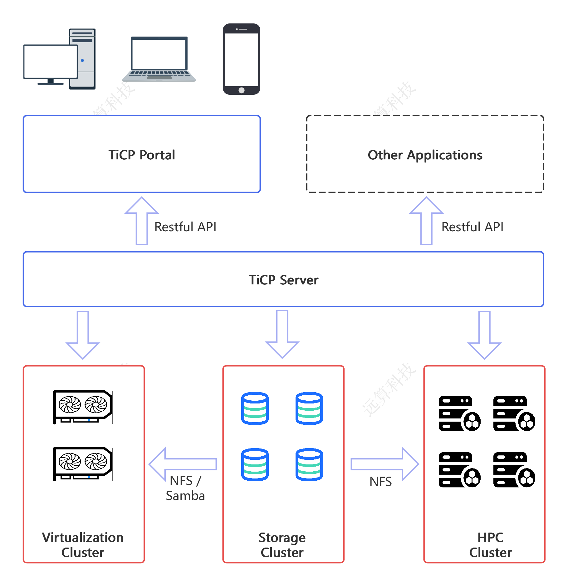

# TiCP-下一代企业级计算型研发平台
## 产品目标
TiCP(Ti Compute Platform)是远算科技有限公司开发的下一代企业级计算型研发平台，可以统一管理HPC集群、虚拟化集群和存储集群。特别适合有CAE仿真需求的企业作为研发平台使用。
## 产品功能
### 云求解
支持HPC集群云化，提供图形化的高性能计算作业管理。
### 云存储
支持文件管理，数据共享和数据隔离功能。
### 3D云桌面
支持将各种3D单机软件云化，支持显卡虚拟化和直通的方式。
## 支持应用
|------------------|------------------|------------------|------------------|
| Ansys Mechanical | Ansys Fluent   | Ansys LS-Dyna    | Ansys CFX        |
| SolidEdge        | NX               | STAR-CCM+        | Isight           | 
| Heeds            | Abaqus           | CATIA            | PowerFlow        |
| XFLow            | Matlab           | MSC Adams        | MSC Nastran      | 
| OptiStruct       | HyperWorks       | ANSA             | Converge         |
| Code Aster       | Code Saturne     | Salome CFD       | Telemac          | 
| PreonLab         | AVL FIRE M       |
## 系统架构

## 使用文档
https://ticp.yuansuan.com/

## 技术交流和反馈
## 联系方式

