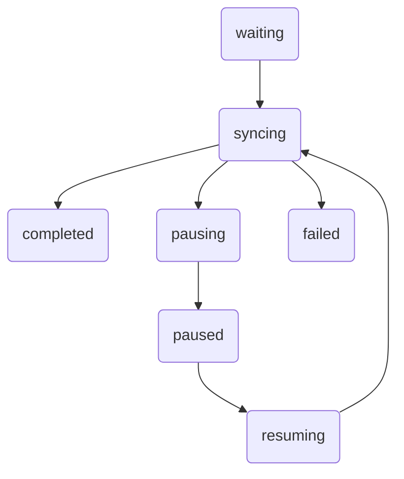

```mermaid
graph TB
    A(waiting) --> B(syncing)
    B(syncing) --> C(completed)
    B(syncing) --> D(pausing)
    D(pausing) --> E(paused)
    E(paused) --> F(resuming)
    F(resuming) --> B(syncing)
    B(syncing) --> H(failed)
```