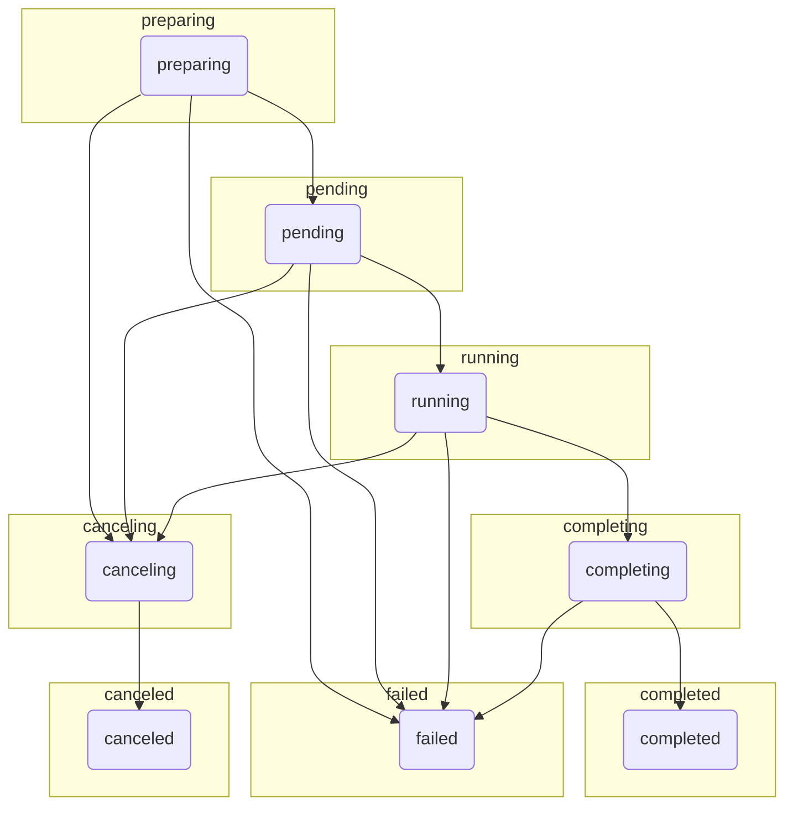

```mermaid
graph TB
    subgraph preparing
        A(preparing)
    end

    subgraph pending
        B(pending)
    end

    subgraph running
        C(running)
    end

    subgraph completing
        D(completing)
    end

    subgraph completed
        E(completed)
    end

    subgraph failed
        F(failed)
    end

    subgraph canceling
        G(canceling)
    end

    subgraph canceled
        H(canceled)
    end

    A --> B
    B --> C
    C --> D
    D --> E

    A --> F
    B --> F
    C --> F
    D --> F

    A --> G
    B --> G
    C --> G
    G --> H

```