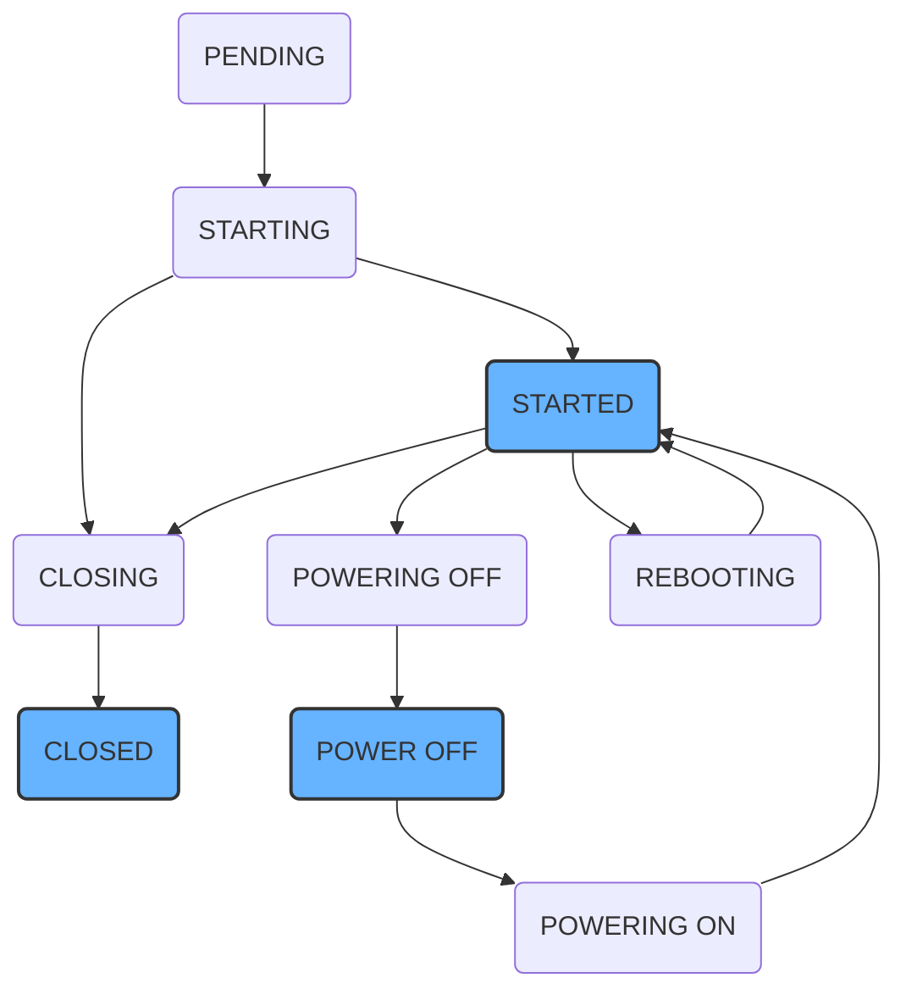

```mermaid
graph TB
    A(PENDING) --> B(STARTING)
    style C fill:#66B3FF,stroke:#333,stroke-width:2px;
    style E fill:#66B3FF,stroke:#333,stroke-width:2px;
    B(STARTING) --> C(STARTED)
    B(STARTING) --> D(CLOSING)
    C(STARTED) --> D(CLOSING)  
    D(CLOSING) --> E(CLOSED)
    C(STARTED) --> F(POWERING OFF)
    style G fill:#66B3FF,stroke:#333,stroke-width:2px;
    F(POWERING OFF) --> G(POWER OFF)
    G(POWER OFF) --> H(POWERING ON)
    H(POWERING ON) --> C(STARTED)
    C(STARTED) --> I(REBOOTING)
    I(REBOOTING) --> C(STARTED) 
```