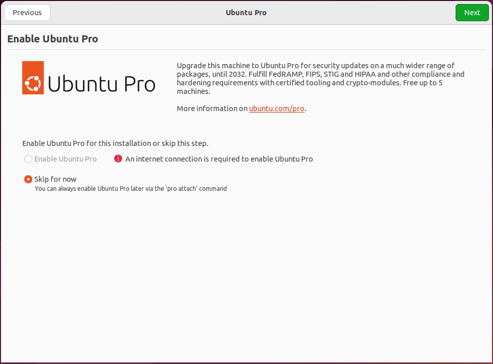
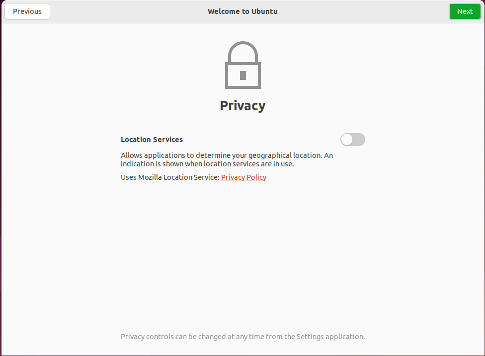
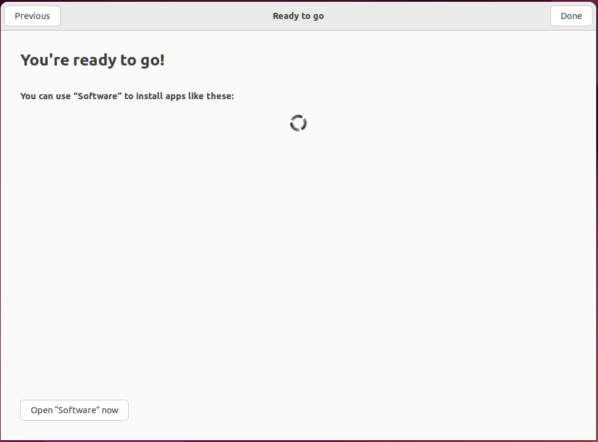
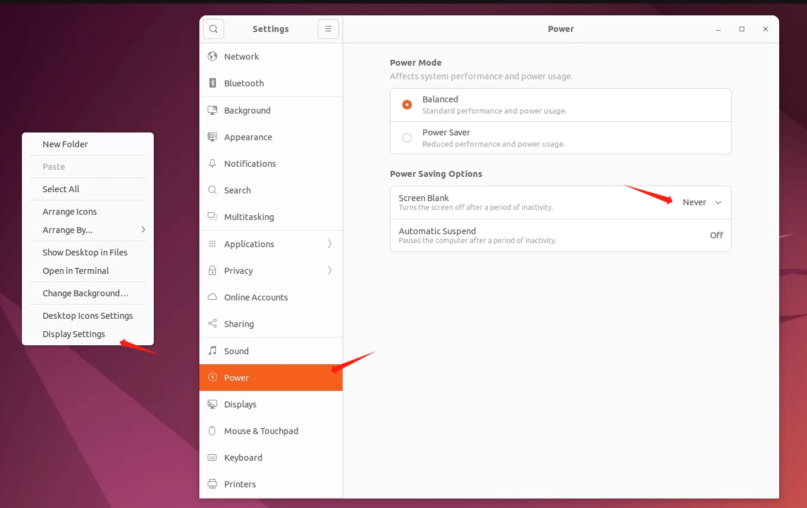

# 基础镜像
本文基于Ubuntu22.04 Cloud image server版本(安装了cloud-init)

## 准备工作

### 允许ssh root password
```shell
vim /etc/ssh/sshd_config
# 确保以下两配置
PermitRootLogin yes
PasswordAuthentication yes

# 重启 sshd
systemctl restart sshd

# 关闭防火墙（可选）如果开着的话
ufw disable
systemctl stop firewalld
```

### 使用国内镜像加速
```bash
cp -a /etc/apt/sources.list /etc/apt/sources.list.bak
sed -i "s@http://.*archive.ubuntu.com@http://mirrors.huaweicloud.com@g" /etc/apt/sources.list
sed -i "s@http://.*security.ubuntu.com@http://mirrors.huaweicloud.com@g" /etc/apt/sources.list
apt update
```

### 添加用户

```bash
groupadd -g 1001 ecp
useradd -g 1001 -m -s /bin/bash -u 2001 ecpuser
```

### 安装ys-cloudapp.target
```bash
install ys-cloudapp.target /lib/systemd/system
systemctl enable ys-cloudapp.target
```

## 安装ys-agent
编译cloudapp_agent linux版本
```bash
make -f build.mk linux-build
```

```bash
# 安装服务
mkdir -p /etc/ys-agent
cp ys-agent /etc/ys-agent/ys-agent
install ys-agent.service /lib/systemd/system
systemctl enable ys-agent
```

## 安装显卡驱动

TODO

## 安装ys-share

```bash
# install cifs-utils
apt install -y cifs-utils

# 安装服务
mkdir -p /etc/ys-share
# 脚本位于 project-root/internal/cloudapp_dirnfs/scripts/linux/start-share.sh
cp start-share.sh /etc/ys-share/start-share.sh
chmod +x /etc/ys-share/start-share.sh
install ys-share.service /lib/systemd/system
systemctl enable ys-share
```

## 安装桌面环境

```bash
# 安装相关依赖
apt install -y xrdp lightdm ubuntu-desktop libyaml-cpp0.7 xclip
# 跳出来选默认窗口管理器的时候，选择 lightdm 
# 如果snap install firefox失败的话，先skip

# 启用相关服务
systemctl enable xrdp --now
systemctl enable xrdp-sesman --now
systemctl enable lightdm --now
```

设置lightdm自动登录用户
```bash
# 修改/etc/lightdm/lightdm.conf, 没有就创建
vim /etc/lightdm/lightdm.conf

# 新增如下内容
[SeatDefaults]
autologin-user=ecpuser

# 重启lightdm
systemctl restart lightdm
```

完成之后，通过控制台或者别的方式进入桌面，完成ubuntu桌面安装的新手引导过程








并且将桌面设置为永不自动熄屏



## 安装lightdesk

仓库地址

`http://phabricator.intern.yuansuan.cn/source/lightdesk/`

```bash
# cp lightdesk to /etc/lightdesk/lightdesk
mkdir -p /etc/lightdesk
cp lightdesk /etc/lightdesk/lightdesk
chmod a+x /etc/lightdesk/lightdesk

# 脚本位于lightdesk仓库 lightdesk/script/deploy/linux/start.sh
cp start.sh /etc/lightdesk/start.sh
chmod a+x /etc/lightdesk/start.sh

cp config.yaml /etc/lightdesk/config.yaml

# 安装服务
install lightdesk.service /lib/systemd/system
systemctl enable lightdesk.service
```

## 软件设置
启动脚本如下

OpenStack
```bash
#!/bin/bash

cat <<EOF > "/etc/ys-agent/agent_env"
SHARE_SERVER=192.168.11.52
SIGNAL_HOST={{.SignalHost}}
SIGNAL_PORT=39002
SIGNAL_USE_SSL=0
ROOM_ID={{.RoomId}}
SHARE_REGISTER_ADDRESS=192.168.11.52:8081
SHARE_USERNAME={{.ShareUsername}}
SHARE_PASSWORD={{.SharePassword}}
SHARE_MOUNT_PATHS={{.ShareMountPaths}}
LOGIN_PASSWORD={{.LoginPassword}}.
REMOTE_APP_USER_PASSES={{.RemoteAppUserPasses}}
EOF

wget http://192.168.11.52:18000/ys-cloudapp/ys-cloudapp.target -O /lib/systemd/system/ys-cloudapp.target
systemctl daemon-reload
systemctl enable ys-cloudapp.target

systemctl stop ys-agent
wget http://192.168.11.52:18000/ys-agent/ys-agent -O /etc/ys-agent/ys-agent
chmod a+x /etc/ys-agent/ys-agent
systemctl start ys-agent

systemctl stop ys-share
wget http://192.168.11.52:18000/ys-share/start-share.sh -O /etc/ys-share/start-share.sh
chmod a+x /etc/ys-agent/start-share.sh
rm -rf /home/ecpuser/Desktop/*
systemctl start ys-share

systemctl stop lightdesk
wget http://192.168.11.52:18000/lightdesk/lightdesk -O /etc/lightdesk/lightdesk
chmod a+x /etc/lightdesk/lightdesk
wget http://192.168.11.52:18000/lightdesk/lightdesk.service -O /lib/systemd/system/lightdesk.service
systemctl daemon-reload
systemctl start lightdesk
```