# 基础镜像

## 安装依赖
执行以下powershell脚本并重启计算机
```powershell
Set-ExecutionPolicy -ExecutionPolicy Bypass -Scope LocalMachine

$ecpPath = "C:\Windows\ys"
New-Item -ItemType directory -Path "$ecpPath" -Force
New-Item -ItemType directory -Path "$ecpPath\logs" -Force
[Environment]::SetEnvironmentVariable("YS_PATH", "$ecpPath", 'Machine')

# Install NFS & Telnet supports
Install-WindowsFeature -Name "Telnet-Client"
Install-WindowsFeature -Name "NFS-Client"
Install-WindowsFeature -Name "FS-SMB1-Client"

# Initializing NFS-Anonymous account
Set-ItemProperty -Path "HKLM:\Software\Microsoft\ClientForNFS\CurrentVersion\Default" -Name "AnonymousUid" -Value "2001" -Type "DWORD"
Set-ItemProperty -Path "HKLM:\Software\Microsoft\ClientForNFS\CurrentVersion\Default" -Name "AnonymousGid" -Value "1001" -Type "DWORD"
```

## 安装ys-agent服务
首先创建一个ysadmin用户（具有管理员权限，密码为远算科技魔法密码）

将agent.exe拷贝至C:\Windows\ys目录下，然后powershell执行

```powershell
cd C:\Windows\System32

# 创建 ys-agent service
sc create ys-agent binPath="C:\Windows\System32\cmd.exe /c C:\Windows\ys\agent.exe"
# 上述命令执行不成功时，也可使用以下命令
New-Service -Name "ys-agent" -BinaryPathName "C:\Windows\System32\cmd.exe /c C:\Windows\ys\agent.exe"
```
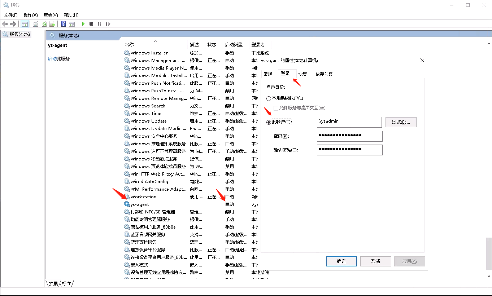

将agent注册到服务中后，按照上图方式，将ys-agent服务“启动类型”设置为“自动”，“登陆”选择“此账户”，信息填ysadmin的账户信息

## 安装共享盘挂载脚本
将cloudapp_dirnfs/scripts/windows/start-stare.ps1脚本，拷贝至C:\Windows\ys

重要：针对每一个可能被使用者登陆的用户，均需要配置其对应的共享盘挂载脚本

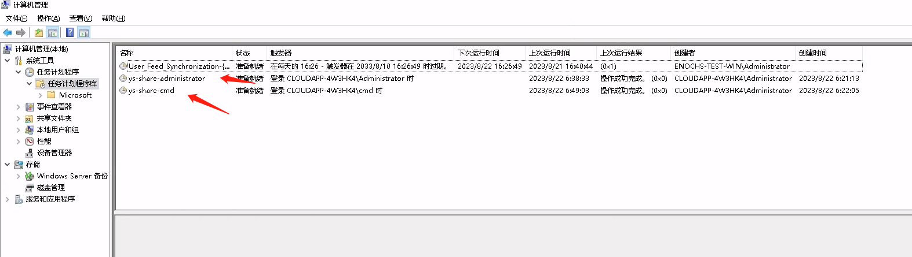

示例：
### Administrator用户
在“计算机管理” -> "系统工具" -> "系统计划程序" 中选择创建任务

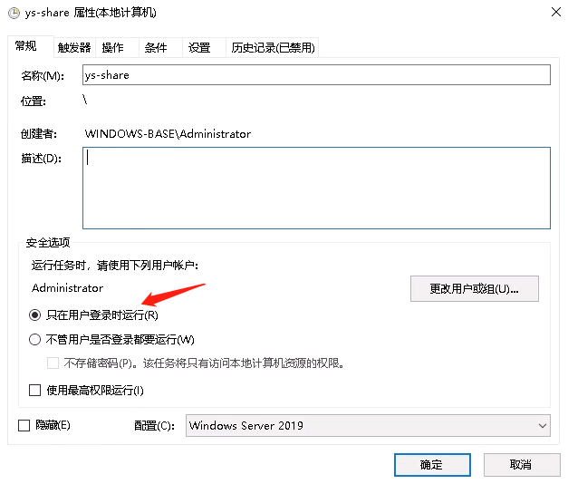

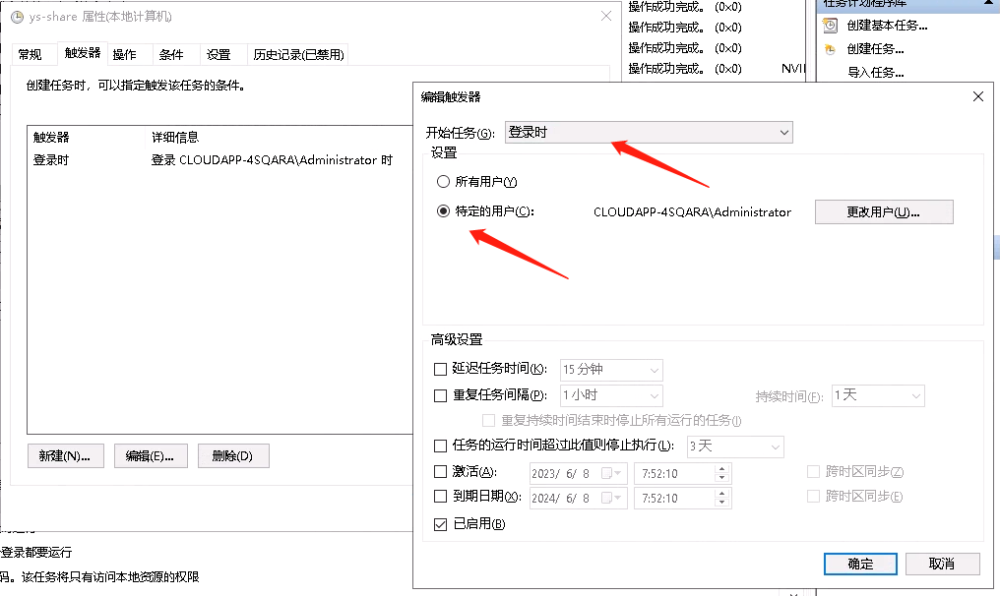

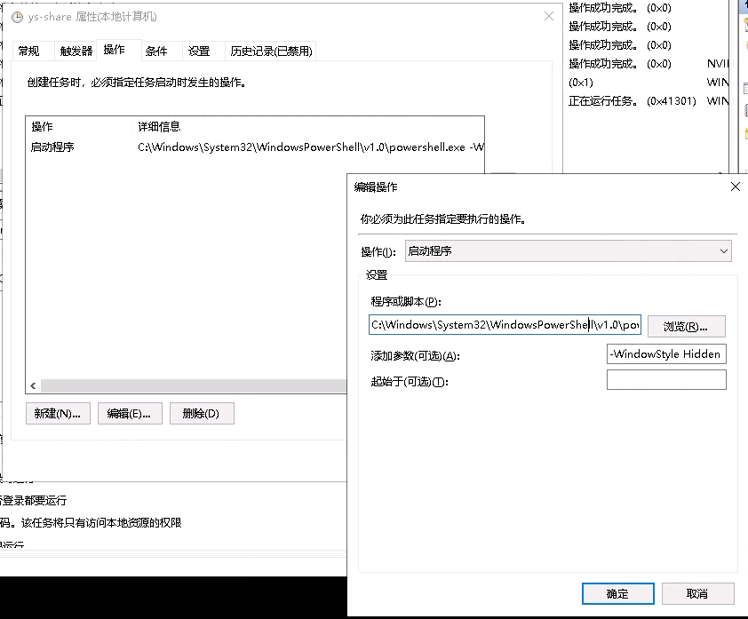

程序或脚本：C:\Windows\System32\WindowsPowerShell\v1.0\powershell.exe

添加参数：-WindowStyle Hidden -File C:\Windows\ys\start-share.ps1

### cmd用户
创建方式同上，有关用户信息需选择cmd

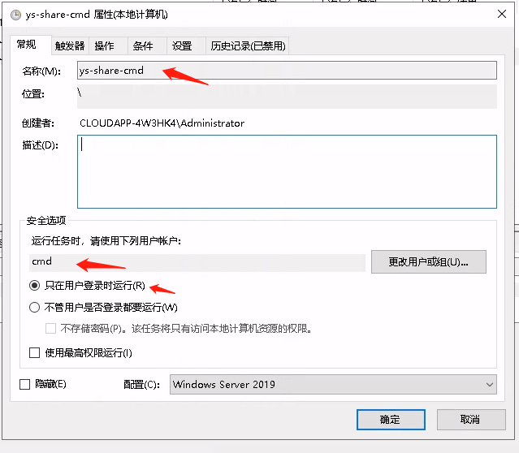

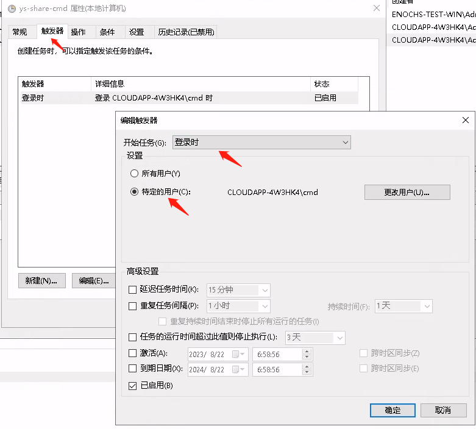


程序或脚本同上

## 禁用密码复杂度检查
运行secpol.msc，“账户策略” -> “密码策略” -> 密码必须符合复杂性要求（设置为禁用）
密码最长使用期限设置为0天（永不过期）

## 开通防火墙端口
### 3389
RDP端口，检查该条入站规则是否启用

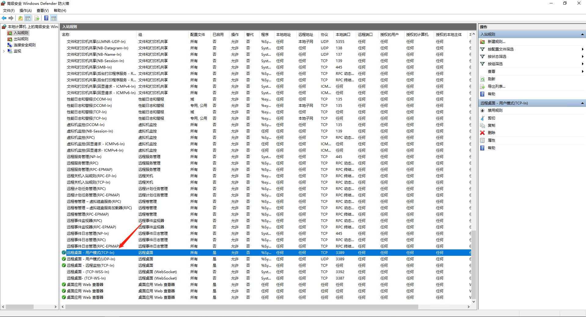

### 3390
ys-agent默认端口，需要添加一条ys-agent入站规则

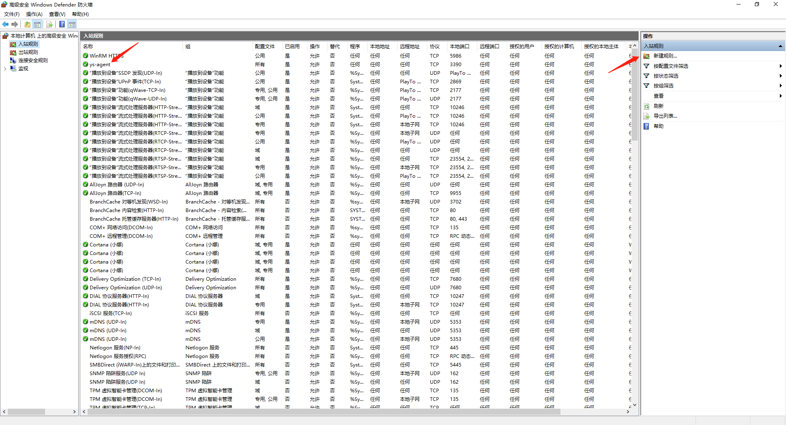

点击新建规则

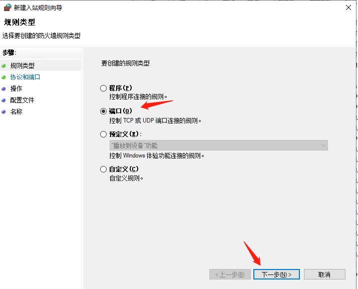

选择端口

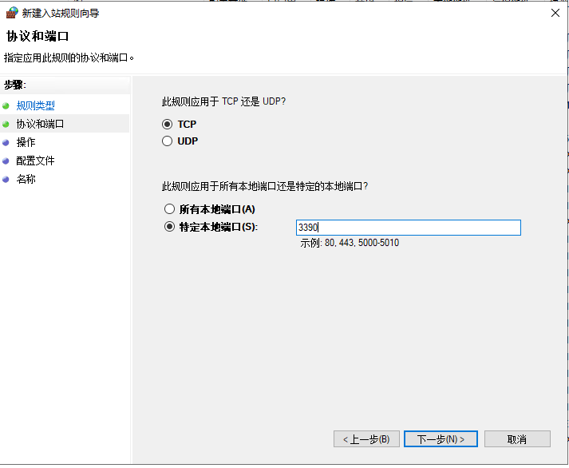

选择TCP，特定本地端口：3390

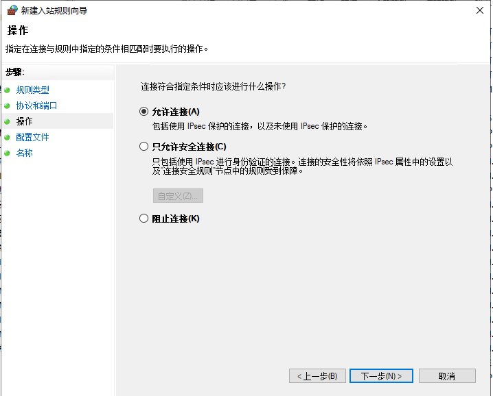

允许连接

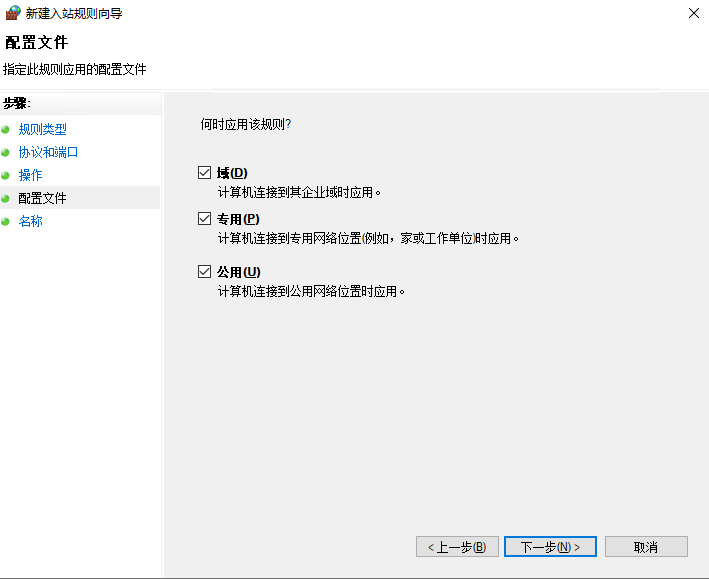

全部勾选

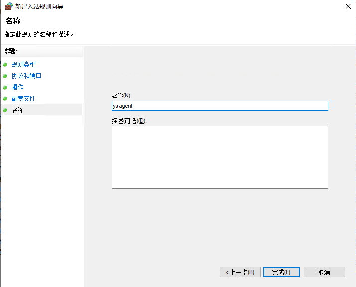

填充规则名称/描述，点击完成即可，并确认规则被启用

## 安装lightdesk
参考 http://phabricator.intern.yuansuan.cn/source/lightdesk/ 该仓库下的编译打包过程，或者询问开发人员，获得一个windows安装包（msi）

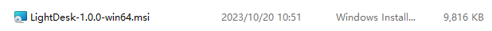

双击安装，建议安装目录为C:\Windows\ys

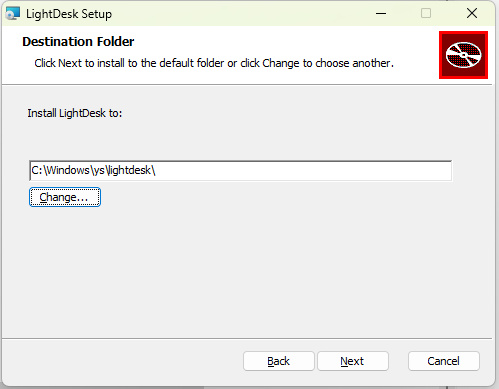

安装完成后会有如下文件

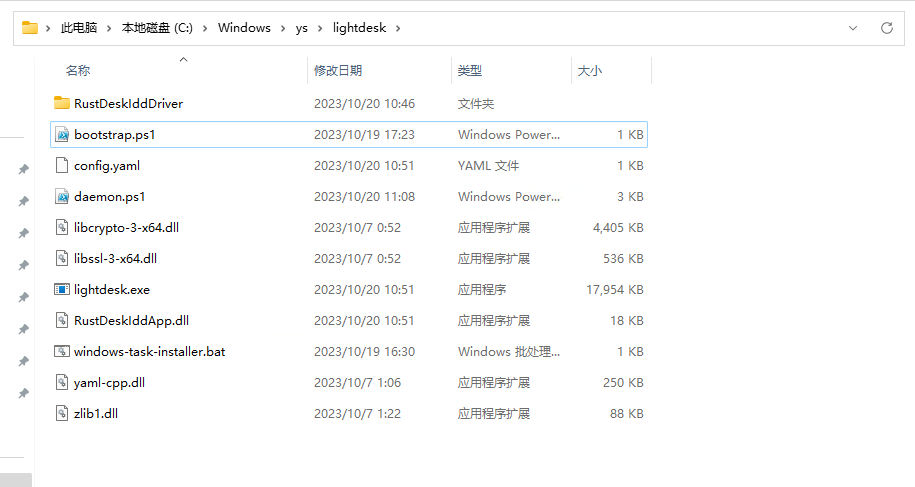

以管理员权限运行windows-task-installer.bat此脚本

### 安装VC++

https://learn.microsoft.com/en-us/cpp/windows/latest-supported-vc-redist?view=msvc-170#visual-studio-2015-2017-2019-and-2022

选择x64版本，下载并双击安装

### IDD 配置

#### 信任证书
进入RustDeskIddDriver目录，有如下文件
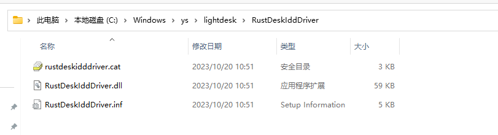

双击.cat文件

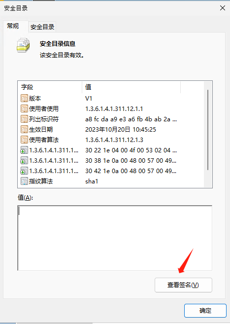

查看签名

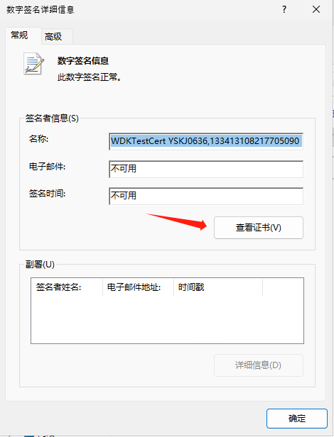

查看证书

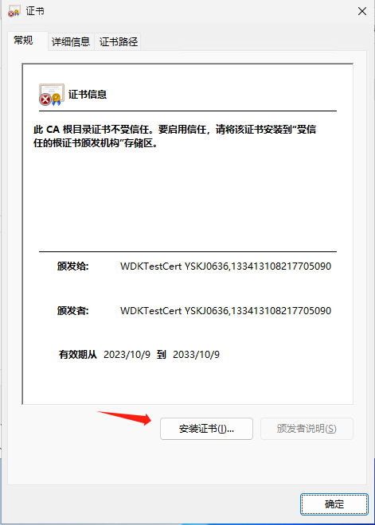

安装证书

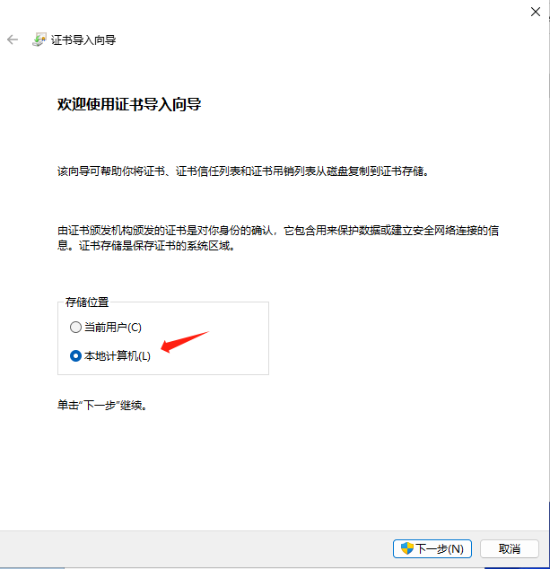

选择本地计算机

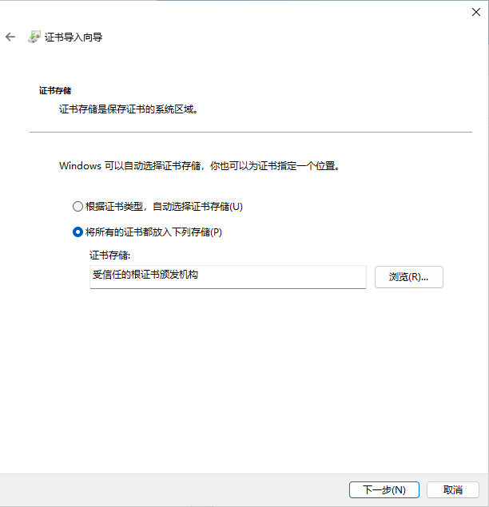

选择 将所有的证书都放入下列存储 -> 受信任的根证书颁发机构

#### 安装驱动
右键.inf文件 -> 安装

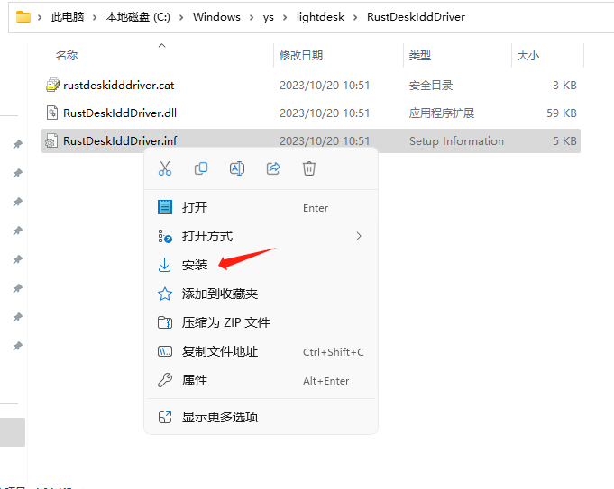

### host配置
如果为openstack自建集群的机器，由于网络条件，导致虚机内部向外请求turnserver的地址需要配置域名映射

例如新增一条如下的host记录
```
192.168.11.55 zhigu-turnserver.yuansuan.cn 
```

## 山河云安装ys-init服务
将cloudapp_agent/doc/shanhe/ys-init.ps1脚本，拷贝至C:\Windows\ys

powershell 执行下列语句，新建一个ys-init服务
```powershell
New-Service -Name "ys-init" -BinaryPathName "C:\Windows\System32\WindowsPowerShell\v1.0\powershell.exe -WindowStyle Hidden -File C:\Windows\ys\ys-init.ps1"
```
同ys-agent服务，需要将ys-init服务“启动类型”设置为“自动”，“登陆”选择“此账户”，信息填ysadmin的账户信息

## Windows软件设置
### 启动脚本
山河云：

```
$filePath = "C:\Windows\ys\agent_env"
$data = @"
# dirnfs ip
SHARE_SERVER=192.168.11.55
SIGNAL_HOST={{.SignalHost}}
SIGNAL_PORT=443
SIGNAL_USE_SSL=1
ROOM_ID={{.RoomId}}
SHARE_REGISTER_ADDRESS=192.168.11.55:8081
SHARE_USERNAME={{.ShareUsername}}
SHARE_PASSWORD={{.SharePassword}}
SHARE_MOUNT_PATHS={{.ShareMountPaths}}
LOGIN_PASSWORD={{.LoginPassword}}
REMOTE_APP_USER_PASSES={{.RemoteAppUserPasses}}
"@

$data | Out-File -FilePath $filePath -Encoding UTF8
Set-ItemProperty "HKLM:\SOFTWARE\Microsoft\Windows NT\CurrentVersion\Winlogon" -Name "DefaultUserName" -Value "Administrator"
Set-ItemProperty "HKLM:\SOFTWARE\Microsoft\Windows NT\CurrentVersion\Winlogon" -Name "DefaultPassword" -Value "{{.LoginPassword}}"
Set-ItemProperty "HKLM:\SOFTWARE\Microsoft\Windows NT\CurrentVersion\Winlogon" -Name "AutoAdminLogon" -Value 1
shutdown /r /t 10
```

OpenStack:

```
<powershell>
# step 1: reset administrator password
$password = ConvertTo-SecureString '{{ .LoginPassword }}' -AsPlainText -Force;
$userAccount = Get-LocalUser -Name 'Administrator';
$userAccount | Set-LocalUser -Password $password -PasswordNeverExpires $true;

# step 2: delete ys-agent service, kill agent.exe
Stop-Process -Name "agent" -Force
sc.exe delete ys-agent

# step 3: update agent.exe
wget http://192.168.11.52:18000/ys-agent/agent.exe -o C:\Windows\ys\agent.exe

# step 4: download schedule task files, register a schedule task for ys-agent
wget http://192.168.11.52:18000/ys-agent/agent-bootstrap.ps1 -o C:\Windows\ys\agent-bootstrap.ps1
wget http://192.168.11.52:18000/ys-agent/agent-daemon.ps1 -o C:\Windows\ys\agent-daemon.ps1
wget http://192.168.11.52:18000/ys-agent/windows-task-installer-for-agent.ps1 -o C:\Windows\ys\windows-task-installer-for-agent.ps1
Start-Process powershell -ArgumentList '-ExecutionPolicy Unrestricted -NoProfile -Sta -File C:\Windows\ys\windows-task-installer-for-agent.ps1' -WindowStyle Hidden


wget http://192.168.11.52:18000/lightdesk/lightdesk.exe -o C:\Windows\ys\lightdesk\lightdesk.exe
wget http://192.168.11.52:18000/lightdesk/daemon.ps1 -o C:\Windows\ys\lightdesk\daemon.ps1

wget http://192.168.11.52:18000/ys-share/start-share.ps1 -o C:\Windows\ys\start-share.ps1

New-Item -ItemType Directory -Path C:\Windows\ys\lightdesk\hidriver
wget http://192.168.11.52:18000/lightdesk/hidriver/hidriver.inf -o C:\Windows\ys\lightdesk\hidriver\hidriver.inf
wget http://192.168.11.52:18000/lightdesk/hidriver/hidriver.sys -o C:\Windows\ys\lightdesk\hidriver\hidriver.sys
wget http://192.168.11.52:18000/lightdesk/hidriver/wudf.cat -o C:\Windows\ys\lightdesk\hidriver\wudf.cat
wget http://192.168.11.52:18000/lightdesk/vhid-client.dll -o C:\Windows\ys\lightdesk\vhid-client.dll
wget http://192.168.11.52:18000/lightdesk/devcon.exe -o C:\Windows\ys\lightdesk\devcon.exe

# get current PATH in env
$currentPath = [System.Environment]::GetEnvironmentVariable("PATH", [System.EnvironmentVariableTarget]::Machine)
$lightdeskPath = "C:\Windows\ys\lightdesk"
# add lightdesk dir to PATH in order to call devcon directly
[System.Environment]::SetEnvironmentVariable("PATH", "$currentPath;$lightdeskPath", [System.EnvironmentVariableTarget]::Machine)

# set windows allow testsign to allow installing vhid device
bcdedit /set testsigning on

$filePath = "C:\Windows\ys\agent_env"
$data = @"
# dirnfs ip
SHARE_SERVER=192.168.11.52
SIGNAL_HOST={{.SignalHost}}
SIGNAL_PORT=39002
SIGNAL_USE_SSL=0
ROOM_ID={{.RoomId}}
SHARE_REGISTER_ADDRESS=192.168.11.52:8081
SHARE_USERNAME={{.ShareUsername}}
SHARE_PASSWORD={{.SharePassword}}
SHARE_MOUNT_PATHS={{.ShareMountPaths}}
LOGIN_PASSWORD={{.LoginPassword}}
REMOTE_APP_USER_PASSES={{.RemoteAppUserPasses}}
"@

$data | Out-File -FilePath $filePath -Encoding UTF8

Set-ItemProperty "HKLM:\SOFTWARE\Microsoft\Windows NT\CurrentVersion\Winlogon" -Name "DefaultUserName" -Value "Administrator"
Set-ItemProperty "HKLM:\SOFTWARE\Microsoft\Windows NT\CurrentVersion\Winlogon" -Name "DefaultPassword" -Value "{{.LoginPassword}}"
Set-ItemProperty "HKLM:\SOFTWARE\Microsoft\Windows NT\CurrentVersion\Winlogon" -Name "AutoAdminLogon" -Value 1
shutdown /r /t 10
</powershell>
```